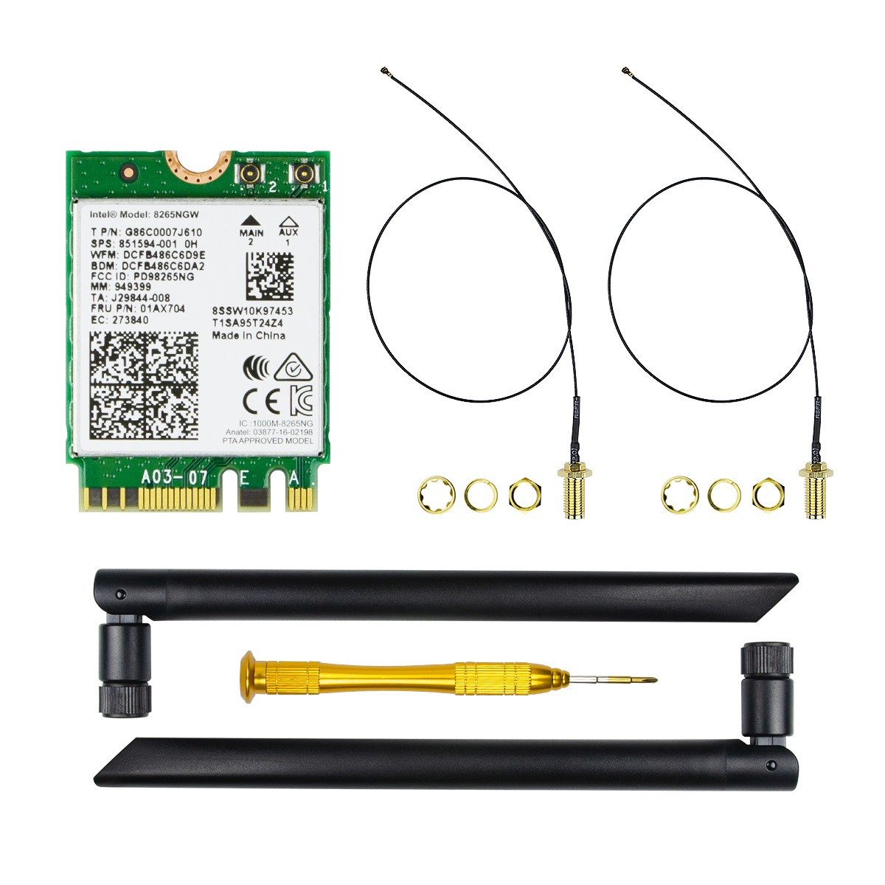

# WiFi on the Jetson Nano

* Hardware Overview
* Setting up access to existing WiFi network
* Setting up as WiFi access point

## Hardware



This setup requires the [8265AC/8265NGW Wireless NIC Module](https://www.amazon.com/gp/product/B07X2NLL85/) be successfully installed.

1. Follow the steps provided with the module for installing the hardware.
1. SSH into the Nano and run `ip a`.

The output should look like this:

```
1: lo: <LOOPBACK,UP,LOWER_UP> mtu 65536 qdisc noqueue state UNKNOWN group default qlen 1
    link/loopback 00:00:00:00:00:00 brd 00:00:00:00:00:00
    inet 127.0.0.1/8 scope host lo
       valid_lft forever preferred_lft forever
    inet6 ::1/128 scope host 
       valid_lft forever preferred_lft forever
2: dummy0: <BROADCAST,NOARP> mtu 1500 qdisc noop state DOWN group default qlen 1000
    link/ether XX:XX:XX:XX:XX:XX brd ff:ff:ff:ff:ff:ff
3: eth0: <BROADCAST,MULTICAST,UP,LOWER_UP> mtu 1500 qdisc pfifo_fast state UP group default qlen 1000
    link/ether 00:04:4b:XX:XX:XX brd ff:ff:ff:ff:ff:ff
    inet XXX.XXX.XXX.XXX/24 brd XXX.XXX.XXX.255 scope global dynamic noprefixroute eth0
       valid_lft 82968sec preferred_lft 82968sec
    inet6 XXXX:XXXX:XXXX:XXXX:XXXX:XXXX/64 scope link noprefixroute 
       valid_lft forever preferred_lft forever
4: l4tbr0: <BROADCAST,MULTICAST> mtu 1500 qdisc noop state DOWN group default qlen 1000
    link/ether XX:XX:XX:XX:XX:XX brd ff:ff:ff:ff:ff:ff
5: wlan0: <BROADCAST,MULTICAST,UP,LOWER_UP> mtu 1500 qdisc mq state UP group default qlen 1000
    link/ether XX:XX:XX:XX:XX:XX brd ff:ff:ff:ff:ff:ff
6: rndis0: <NO-CARRIER,BROADCAST,MULTICAST,UP> mtu 1500 qdisc pfifo_fast master l4tbr0 state DOWN group default qlen 1000
    link/ether XX:XX:XX:XX:XX:XX brd ff:ff:ff:ff:ff:ff
7: usb0: <NO-CARRIER,BROADCAST,MULTICAST,UP> mtu 1500 qdisc pfifo_fast master l4tbr0 state DOWN group default qlen 1000
    link/ether XX:XX:XX:XX:XX:XX brd ff:ff:ff:ff:ff:ff
``` 

If you see `wlan0`, then you're good to proceed.

Some possible issues:

* Jetson Nano power light does not come on after installation - Remove and reinstall the wireless module.

## Setting up access to existing WiFi network

Using `nmcli`, the Network Manager Command Line Interface utility (replace `<text>` to suit your needs):

1. `$ sudo su`
1.  `# nmcli c a con-name "<CONNECTION_NAME>" ifname wlan0 type wifi ssid "<YOUR_WIFI_NETWORK_SSID>"`
	1. (optional) add to the command: `ip4 10.79.20.205/24 gw4 10.79.20.1` to assign an IP address and gateway address
1. `# nmcli c m "<CONNECTION_NAME>" wifi-sec.key-mgmt wpa-psk`
1. `# nmcli c m "<CONNECTION_NAME>" wifi-sec.psk "<YOUR_WIFI_NETWORK_PASSWORD>"`
1. Connect using: `$ nmcli c up "<CONNECTION_NAME>"`

## Setting up as WiFi access point

* Steps adapted from this guide [here](http://variwiki.com/index.php?title=Wifi_NetworkManager#Creating_WiFi_AP).
* The configured AP will be enabled at boot.
* Sets up a 2.4GHz wireless access point.

1. `$ sudo rfkill unblock wifi`
1. `$ sudo nmcli r w on`
1. `$ sudo nmcli c a type wifi ifname wlan0 mode ap con-name <name> ssid <ssid>`
1. `$ sudo nmcli c m <name> 802-11-wireless.band bg`
1. `$ sudo nmcli c m <name> 802-11-wireless.channel 11`
1. `$ sudo nmcli c m <name> wifi-sec.key-mgmt wpa-psk`
1. `$ sudo nmcli c m <name> 802-11-wireless-security.proto rsn`
1. `$ sudo nmcli c m <name> 802-11-wireless-security.group ccmp`
1. `$ sudo nmcli c m <name> 802-11-wireless-security.pairwise ccmp`
1. `$ sudo nmcli c m <name> 802-11-wireless-security.psk <passphrase>`
1. `$ sudo nmcli c m <name> ipv4.method shared`
1. `$ sudo nmcli c up <name>`

By default, `nmcli` runs a DHCP server on subnet `10.42.0.0/24` and assigns the host to `10.42.0.1`

1. `$ sudo nmcli con modify <name> ipv4.addr <ipaddress/prefix>` to change customize.
